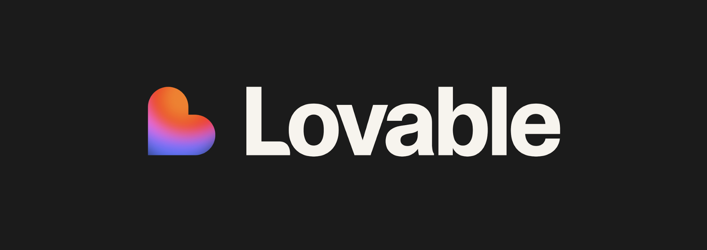
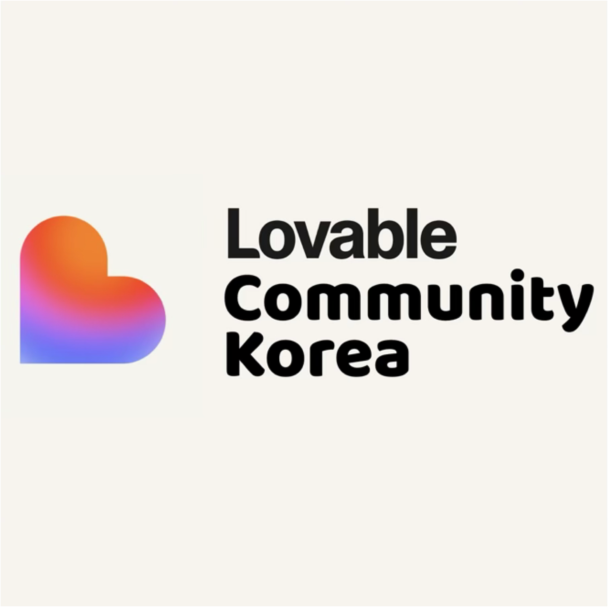

# Lovable Community Korea 🇰🇷

안녕하세요! 한국 Lovable.dev 커뮤니티, Lovable Community Korea 입니다.

저희는 한국에 Lovable.dev 커뮤니티가 없다는 것을 확인하고, 커뮤니티 멤버들의 자발적인 참여로 만들어지고 운영되는 커뮤니티입니다. (2025-09-07 기준)

"커뮤니티 활동을 모두 오픈소스화 하는 것"을 가장 중요한 가치로 생각하며, 모든 활동을 투명하게 공개하고 함께 만들어나가는 것을 목표로 합니다.

 

## 🔗 참여하기

- **Threads:** [@lovable.dev.korea](https://threads.com/@lovable.dev.korea)
- **Discord:** [참여 링크](https://discord.gg/AmVzYcyg3h)

 

## 📝 제안 (Proposals)

Lovable Community Korea는 커뮤니티의 운영 방향과 표준을 함께 만들어갑니다. 아래 링크에서 진행중인 논의에 참여해주세요!

- **라이센스(License) Proposal 논의:** [바로가기](https://discord.com/channels/1408062170255851562/1418734114990723202)
- **프로젝트 표준(Project Standard) Proposal 논의:** [바로가기](https://discord.com/channels/1408062170255851562/1419078689525858354)

> `https://korea-community.lovable.app/` 의 프로젝트 리스팅을 위해 표준을 정의하고 있습니다.

 

## 💬 커뮤니티 마스터 Q&A

**Q1. Lovable Community Korea 는 어떤 곳인가요?**

A1. Lovable Community Korea는 한국에 Lovable.dev 커뮤니티가 없다는 것을 확인하고, 커뮤니티 드리븐으로 만들고, 운영하게 된 커뮤니티예요. 2025년 9월 7일 기준으로 모두 자발적인 참여로 운영되고 있어요. Lovable.dev의 Sebastian과 연락하며 운영하고 있습니다.

**Q2. Lovable.dev 팀 사람들은 참여 계획이 없나요?**

A2. Lovable.dev 팀은 출시 첫 해(2025년)에 280,000명의 월간 활성 사용자, 94%의 고객 만족도를 달성한 팀이에요. 2025년 1월 출시하여, 2025년 5월 5천만 달러 ARR을 달성하며 엄청난 기록을 세웠어요. 근데요. 단 20명 내외의 팀원으로 말이죠. 그래서 굉장히 바쁜 팀이에요. Sebastian과 연락하며 커뮤니티 마스터인 제가 각을 보고 있어요.

* 공식 커뮤니티 [디스코드](https://discord.gg/2KRB3gyX5p) 가 있어요.

**Q3. `launched.lovable.dev` 가 뭔가요?**

A3. Product Hunt 들어보셨나요? Lovable.dev 팀은 자체 생태계를 구축하고 있어요. Lovable로 빌드 된 앱을 런칭하는 플랫폼이에요. 글로벌 런칭을 준비하고 계신 분이라면 꼭 참고해보세요! Lovable.dev 팀 Anton이 SNS에 계속 Lovable.dev 제품으로 만든 제품의 성과를 자랑하는 것을 보면, 굉장히 중요하게 생각하고 있는 부분 같아요.

**Q4. 커뮤니티 마스터님은 왜 이런 커뮤니티를 운영하나요?**

A4. 재미랄까요. 제가 대학생 때 리그 오브 레전드라는 게임이 있었어요. 그 게임은 모두가 재밌어하고 모두가 즐기는 게임이었거든요. 저는 잘하지는 못했지만 친구들과 어울리고 싶어서 했는데요. 그 당시 닉네임이 '롤은망할것이다' 였습니다. 그 당시 친구들이 느꼈던 롤에 대한 감정이 저는 AI, LLM 시대에 이런 것들을 하는데에서 느끼고 있는 감정이라고 느껴요. 그래서 아무런 대가도 없이 이런 활동을 하는 것이 즐겁습니다. 앞으로도 지켜봐주세요.

**Q5. 커뮤니티로 들어오는 후원, 수익 등이 발생하면 어떻게 하실건가요?**

A5. 전액 환원합니다. 저는 이 커뮤니티를 제 사리사욕을 채우기 위해 운영하는 것이 아니고, Q4에서 답변한 바와 같이 이 커뮤니티 활동을 통해 재미를 얻을 수 있다면 그것으로 충분합니다. AI, LLM 시대에서 이런 단순 반복 노동의 비용은 충분히 낮아졌고, 대가를 받을 정도의 무언가가 아니게 되었다고 생각합니다. 최초로 발생하게 되는 일이 생기면, 투명하게 공개하고 처리 과정을 공유드리겠습니다.

 

## 참고

| 이미지 | URL | 특이사항 |
|--------|-----|----------|
|  | [Lovable 바로가기](https://lovable.dev?via=lck-github-for-share) | Build Something Lovable |
|  | [디스코드 커뮤니티](https://threads.com/@lovable.dev.korea) | Lovable Community Korea, 러버블 한국 사용자 모임 입니다. |
|  | [챌린지 리더보드](https://korea-community.lovable.app) | Lovable Community Korea, 러버블 한국 사용자 모임 입니다. |

---

**많은 관심과 참여 부탁드립니다!**
